# OMSS Documentation


**omss** is a Python package for generating matrix reasoning puzzles,
inspired by Raven’s Progressive Matrices, designed to assess fluid
intelligence. It allows users to generate an unlimited number of
customizable puzzles across a range of difficulty levels. The package
was inspired in part by
[`raven-gen`](https://github.com/shlomenu/raven-gen).  
*Chi Zhang*, *Feng Gao*, *Baoxiong Jia*, *Yixin Zhu*, *Song-Chun Zhu*
*Proceedings of the IEEE Conference on Computer Vision and Pattern
Recognition (CVPR), 2019*

**omss** has been rebuilt from scratch, with a focus on flexibility,
reproducibility, and suitability for human testing.

## Contents

- [Overview](#overview)
- [Installation](#installation)
- [Rules and RuleTypes](#ruletypes)
- [Elements and AttributeTypes](#elements-and-attributetypes)
- [Alternatives Generation](#alternatives-generation)
- [Seeds](#seeds)
- [Matrix Generation](#matrix-generation)
- [Output](#output)

## Overview

OMSS works with **elements** which a placed in 3 x 3 matrix. These
elements have a visual appearance which is determined by their
**atributes**. Specific instances of these attributes may change within
a row according to a logical pattern. This logical pattern is determined
by the user with **Rules**.

### Function Signature

**`create_matrix(rules, alternatives=None, seed=None, alternative_seed=None, save=True, output_file=False, element_types=None, path=None)`**

#### Parameters

- **`rules`** (*required*, `dict`):  
  A dictionary containing both the `RuleType` and the `AttributeType`
  that each rule applies to.

- **`alternatives`** (`int`, optional):  
  The number of alternatives to generate. Must be between 0 and 32 (up
  to 64 depending on settings).  
  Default: `None`.

- **`seed`** (`int`, optional):  
  Seed for the main matrix generation. Used for reproducibility.  
  Default: `None`.

- **`alternative_seed`** (`int`, optional):  
  Seed for generating alternatives.  
  Default: `None`.

- **`save`** (`bool`, optional):  
  Whether to save the matrix and alternatives to disk.

  - `True`: Saves files to the specified path (or a default folder).  
  - `False`: Returns the matrix and alternatives as Python objects.  
    Default: `True`.

- **`output_file`** (`bool`, optional):  
  Whether to generate an extra output file with metadata about the
  rules, seeds, alternatives.  
  Default: `False`.

- **`element_types`** (`list` or `None`, optional):  
  Specifies which elements to include in the matrix.

  - If `None`, all elements listed in the `rules` will be used.  
    Default: `None`.

- **`path`** (`str` or `None`, optional):  
  Path where matrices and alternatives will be saved.

  - If `None` and `save=True`, a folder named `OMSS_output` is created
    in the user’s Documents directory.  
    Default: `None`.

------------------------------------------------------------------------

### Example

In the example below, we use the program to define some rule types for
the attributes of an element called BigShape. To keep things simple,
we’ll create a basic puzzle by applying the CONSTANT rule type and using
the program’s default settings by only specifying the rules.

UPDATE THIS EXAMPLE

``` python
#import statements
import omss
from omss import Ruletype, AttributeType, Rule, create_matrix, plot_matrices

#the dictionary for the in which RuleTypes are coupled to AttributeTypes
rules = {
    'BigShape': [       
        Rule(Ruletype.DISTRIBUTE_THREE, AttributeType.SHAPE),
        Rule(Ruletype.CONSTANT, AttributeType.ANGLE),
        Rule(Ruletype.CONSTANT, AttributeType.COLOR),
        Rule(Ruletype.CONSTANT, AttributeType.NUMBER),
        Rule(Ruletype.FULL_CONSTANT, AttributeType.SIZE, value = 'medium')]}
    
#create the matrices
solution_matrix, problem_matrix = create_matrix(rules, save = False)

#plot the matrices
plot_matrices(solution_matrix, problem_matrix)
```


In the following sections, we will first cover the different **rules**,
**elements**, and their **attributes**. Next, we’ll explain the process
of **matrix generation**, the creation of **alternatives**, how
**seeds** function, and finally, some additional **custom settings**.

------------------------------------------------------------------------

## Installation

OMSS can be installed using `pip`:

``` bash
pip install omss
```

or downloaded directly from the github

``` bash
git clone https://github.com/aranvhout/OMSS_generator
cd OMSS_generator
pip install .
```

Once installed downloaded the following imports are required

``` python
from omss import Ruletype, AttributeType, Rule, create_matrix, plot_matrices
```

------------------------------------------------------------------------

## Rules

Rules are defined by the user and determine how attributes change across
columns in the matrix. Each rule is composed of a RuleType and an
AttributeType. The RuleType defines the logical pattern of modification,
while the AttributeType specifies which attribute is affected.

Most RuleTypes are general and can operate on any AttributeType.
However, each AttributeType can be governed by only one RuleType.

Since RuleTypes are general and shared across elements, they are
discussed here. AttributeTypes, on the other hand, are specific to each
element and will be addressed in the Elements section.

### RuleTypes

OMSS uses 5 different RuleTypes, namely: constant, full_constant,
distribute_three, progression and arithmetic

#### **CONSTANT**

The `CONSTANT` rule ensures that an attribute remains unchanged **within
a row**.  
For example, if a `color` attribute is governed by the `CONSTANT` rule,
all elements in the same row will have the same color.

------------------------------------------------------------------------

#### Example

Let’s create a very straightforward matrix puzzle. We’ll once again use
the BigShape element and set all of its AttributeTypes to CONSTANT,
ensuring that no attribute changes within any row. This creates a
simple, uniform pattern and serves as a good starting point for
understanding how rule definitions work.

``` python
import omss
from omss import Ruletype, AttributeType, Rule, create_matrix, plot_matrices

rules = {
    'BigShape': [       
        Rule(Ruletype.CONSTANT, AttributeType.SHAPE),
        Rule(Ruletype.CONSTANT, AttributeType.ANGLE),
        Rule(Ruletype.CONSTANT, AttributeType.COLOR),
        Rule(Ruletype.CONSTANT, AttributeType.NUMBER),
        Rule(Ruletype.CONSTANT, AttributeType.SIZE)]}
    

#create the matrices
solution_matrix, problem_matrix = create_matrix(rules, save = False)

#plot the matrices
plot_matrices(solution_matrix, problem_matrix)
```


#### **FULL_CONSTANT**

The `FULL_CONSTANT` rule ensures that an attribute remains unchanged
**across the entire matrix**. It is also possible to specify the
specific value of the unchanged attribute.

#### Example

Let’s simplify the previous example even further by applying the
FULL_CONSTANT rule to the color attribute. This means that all elements
in the matrix will now have the same color, as opposed to the previous
case where colors were constant only within rows.

To further enhance the uniformity of the matrix, we’ll also apply the
FULL_CONSTANT rule to the size attribute and fix it to a preselected
value. The available size values are ‘small’, ‘medium’, and ‘large’.

``` python
import omss
from omss import Ruletype, AttributeType, Rule, create_matrix, plot_matrices

rules = {
    'BigShape': [       
        Rule(Ruletype.CONSTANT, AttributeType.SHAPE),
        Rule(Ruletype.CONSTANT, AttributeType.ANGLE),
        Rule(Ruletype.FULL_CONSTANT, AttributeType.COLOR),
        Rule(Ruletype.CONSTANT, AttributeType.NUMBER),
        Rule(Ruletype.FULL_CONSTANT, AttributeType.SIZE, value = 'medium')]}
    

#create the matrices
solution_matrix, problem_matrix = create_matrix(rules, save = False)

#plot the matrices
plot_matrices(solution_matrix, problem_matrix)
```

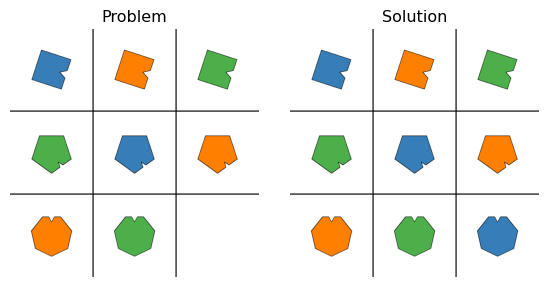

#### **DISTRIBUTE_THREE**

The `DISTRIBUTE_THREE` rule distributes **three distinct values** of an
attribute across each row.  
For example, if the `shape` attribute uses this rule, each row will
contain the same three different shapes (e.g., triangle, square,
circle).

#### Example

Until now, our puzzles have been fairly lackluster. By applying the
`DISTRIBUTE_THREE` rule, we can start creating puzzles with actual
variation and a more complicated logical structure.

Let’s enhance the previous matrix by applying the `DISTRIBUTE_THREE`
rule to the color attribute. This means each row will now contain three
different colors, adding a more interesting pattern for the solver to
detect.

``` python
import omss
from omss import Ruletype, AttributeType, Rule, create_matrix, plot_matrices

rules = {
    'BigShape': [       
        Rule(Ruletype.CONSTANT, AttributeType.SHAPE),
        Rule(Ruletype.CONSTANT, AttributeType.ANGLE),
        Rule(Ruletype.DISTRIBUTE_THREE, AttributeType.COLOR),
        Rule(Ruletype.CONSTANT, AttributeType.NUMBER),
        Rule(Ruletype.FULL_CONSTANT, AttributeType.SIZE, value = 'medium')]}
    

#create the matrices
solution_matrix, problem_matrix = create_matrix(rules, save = False)

#plot the matrices
plot_matrices(solution_matrix, problem_matrix)
```

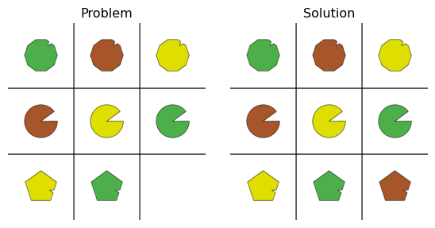

It’s also possible to apply multiple `DISTRIBUTE_THREE` rules to
different attribute types within a single matrix. Building on the
previous example, we now apply a `DISTRIBUTE_THREE` rule to both the
shape and color attributes. This creates an even more varied and
engaging puzzle by distributing three distinct shapes and three distinct
colors across each row.

``` python
import omss
from omss import Ruletype, AttributeType, Rule, create_matrix, plot_matrices

rules = {
    'BigShape': [       
        Rule(Ruletype.DISTRIBUTE_THREE, AttributeType.SHAPE),
        Rule(Ruletype.CONSTANT, AttributeType.ANGLE),
        Rule(Ruletype.DISTRIBUTE_THREE, AttributeType.COLOR),
        Rule(Ruletype.CONSTANT, AttributeType.NUMBER),
        Rule(Ruletype.FULL_CONSTANT, AttributeType.SIZE, value = 'medium')]}
    

#create the matrices
solution_matrix, problem_matrix = create_matrix(rules, save = False)

#plot the matrices
plot_matrices(solution_matrix, problem_matrix)
```

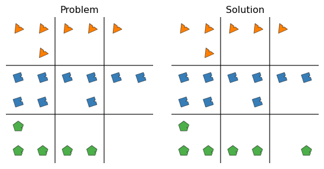

------------------------------------------------------------------------

#### **PROGRESSION**

The PROGRESSION rule increases or decreases the value of an attribute
across a row. For example, when applied to the size attribute, element
sizes will progressively grow or shrink within each row.

Attributes are represented by classes that have a defined order. The
PROGRESSION rule follows this order to modify attribute values
step-by-step. For instance, the shape attribute is ordered from simpler
to more complex shapes, allowing the rule to create a logical
progression.

`PROGRESSION` can be also applied to less intuitive attributes, such as
color; however, doing so might produce less intuitive or meaningful
results.

------------------------------------------------------------------------

#### Example

To properly showcase the `PROGRESSION` rule we will introduce a new type
of `element`, namely `LittleShape`. `LittleShape` is quite similar to
`BigShape` in terms of its attributes and appearance, but it is a bit
smaller. As a consequence, it is possible to fit multiple `LittleShape`
elements a single grid.

Below we will apply a `PROGRESSION` rule to `LittleShape`’s number
attribute! As you can see the number of elements increases/decreases

``` python
import omss
from omss import Ruletype, AttributeType, Rule, create_matrix, plot_matrices

rules = {
    'LittleShape': [       
        Rule(Ruletype.CONSTANT, AttributeType.SHAPE),
        Rule(Ruletype.CONSTANT, AttributeType.ANGLE),
        Rule(Ruletype.CONSTANT, AttributeType.COLOR),
        Rule(Ruletype.PROGRESSION, AttributeType.LITTLESHAPENUMBER),
        Rule(Ruletype.FULL_CONSTANT, AttributeType.SIZE, value = 'medium')]}
    

#create the matrices
solution_matrix, problem_matrix, = create_matrix(rules, save = False)

#plot the matrices
plot_matrices(solution_matrix, problem_matrix)
```

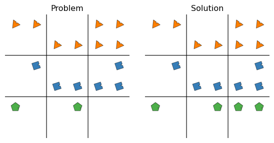

------------------------------------------------------------------------

#### **ARITHMETIC**

The `ARITHMETIC` rule performs **addition or subtraction operations**,
and can only be applied to numeric attributes. If multiple element types
share this rule, their attribute values will be added to or subtracted
from one another.

------------------------------------------------------------------------

#### Example

We will now use the LittleShape element to demonstrate the ARITHMETIC
rule by applying it to its numeric attribute, littleshapenumber.

``` python
import omss
from omss import Ruletype, AttributeType, Rule, create_matrix, plot_matrices

rules = {
    'LittleShape': [       
        Rule(Ruletype.CONSTANT, AttributeType.SHAPE),
        Rule(Ruletype.CONSTANT, AttributeType.ANGLE),
        Rule(Ruletype.CONSTANT, AttributeType.COLOR),
        Rule(Ruletype.ARITHMETIC, AttributeType.LITTLESHAPENUMBER),
        Rule(Ruletype.FULL_CONSTANT, AttributeType.SIZE, value = 'medium')]}


#create the matrices
solution_matrix, problem_matrix, = create_matrix(rules, save = False)

#plot the matrices
plot_matrices(solution_matrix, problem_matrix)
```

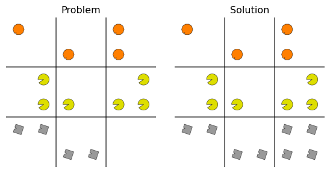

It’s also possible to control the direction of the arithmetic operation
(addition or subtraction). Let’s recreate the previous example using the
LittleShape element, but this time explicitly set the operation to
addition.

``` python
import omss
from omss import Ruletype, AttributeType, Rule, create_matrix, plot_matrices

rules = {
    'LittleShape': [       
        Rule(Ruletype.CONSTANT, AttributeType.SHAPE),
        Rule(Ruletype.CONSTANT, AttributeType.ANGLE),
        Rule(Ruletype.CONSTANT, AttributeType.COLOR),
        Rule(Ruletype.ARITHMETIC, AttributeType.LITTLESHAPENUMBER, direction = 'addition'),
        Rule(Ruletype.FULL_CONSTANT, AttributeType.SIZE, value = 'medium')]}
    

#create the matrices
solution_matrix, problem_matrix, = create_matrix(rules, save = False)

#plot the matrices
plot_matrices(solution_matrix, problem_matrix)
```

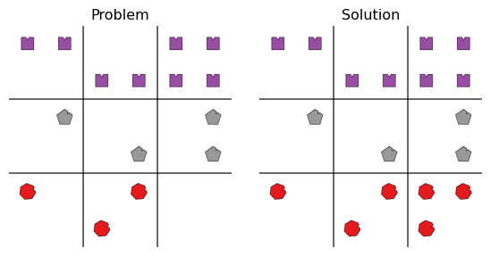

Finally, let’s see what happens when we combine multiple elements in a
single grid and apply the ARITHMETIC rule. To do this, we simply need to
define rules for each element and include them in the same rules
dictionary.

In the example below, we combine both LittleShape and BigShape, and
apply the ARITHMETIC rule to the NUMBER attribute of both. The resulting
matrix will perform arithmetic operations across the values of both
element types.

``` python
import omss
from omss import Ruletype, AttributeType, Rule, create_matrix, plot_matrices

rules = {
    'LittleShape': [       
        Rule(Ruletype.CONSTANT, AttributeType.SHAPE),
        Rule(Ruletype.CONSTANT, AttributeType.ANGLE),
        Rule(Ruletype.CONSTANT, AttributeType.COLOR),
        Rule(Ruletype.ARITHMETIC, AttributeType.LITTLESHAPENUMBER),
        Rule(Ruletype.FULL_CONSTANT, AttributeType.SIZE, value = 'medium')],
     'BigShape': [       
        Rule(Ruletype.CONSTANT, AttributeType.SHAPE),
        Rule(Ruletype.CONSTANT, AttributeType.ANGLE),
        Rule(Ruletype.CONSTANT, AttributeType.COLOR),
        Rule(Ruletype.ARITHMETIC, AttributeType.NUMBER),
        Rule(Ruletype.FULL_CONSTANT, AttributeType.SIZE, value = 'medium')]}

#create the matrices
solution_matrix, problem_matrix, = create_matrix(rules, save = False)

#plot the matrices
plot_matrices(solution_matrix, problem_matrix)
```

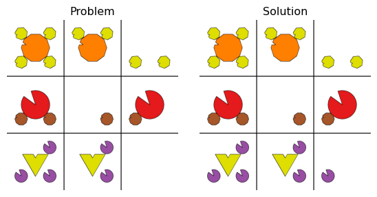

Amazing! As you can see, the arithmetic operation is being combined
across the two elements.

Note: It is not possible to apply the ARITHMETIC rule to BigShape alone,
since it only supports two numeric values (0 and 1). Applying arithmetic
in isolation would result in empty grids and is thus prohibited by the
program.

## Elements and AttributeTypes

As of yet OMSS supports three different elements. `BigShape`,
`LittleShape` and \`Line’. Each of these elements has a unique visual
representation and is characterized by a specific set of attributetypes.
LittleShape and Bigshape share many attributetypes, whereas Line is more
unique. The following section provides a detailed overview of each
element and its associated attributetypes.

### BigShape

`BigShape` supports the following attribute types:

- **`SHAPE`**  
  Defines the shapes of the BigShape object. There are currently six
  shapes, ordered from least to most polygonal: `TRIANGLE`, `SQUARE`,
  `PENTAGON`, `SEPTAGON`, and `CIRCLE`.

- **`COLOR`**  
  Specifies the color of the object. Eight color options are available:
  `BLUE`, `ORANGE`, `GREEN`, `BROWN`, `PURPLE`, `GRAY`, `RED`, and
  `YELLOW`. All hues have been selected to be colorblind-friendly.

- **`SIZE`**  
  Determines the scale of the BigShape. There are three size instances:
  `SMALL`, `MEDIUM`, and `LARGE`.

- **`ANGLE`**  
  Specifies the rotation angle of the BigShape object. This attribute
  includes 10 discrete values, increasing in 36-degree increments. It is
  particularly well-suited for the `PROGRESSION` rule type.

- **`NUMBER`**  
  Indicates the number of BigShape objects placed within a grid cell. By
  default, only a single instance (`ONE`) is supported. However, when
  the `ARITHMETIC` rule is applied, this attribute may be overridden
  (e.g., set to `NONE`) to allow for arithmetic operations on the number
  of elements.

#### Example

Let’s uses these attributypes to create a more constrained puzzle for
Bigshape. Specifically, we will use some of the instances above to make
a puzzle of red, medium sized squares with a progression in the angle
(i.e. making the triangle rotate).

``` python
import omss
from omss import Ruletype, AttributeType, Rule, create_matrix, plot_matrices

rules = {
    'BigShape': [       
        Rule(Ruletype.FULL_CONSTANT, AttributeType.SHAPE, value = 'triangle'),
        Rule(Ruletype.PROGRESSION, AttributeType.ANGLE),
        Rule(Ruletype.FULL_CONSTANT, AttributeType.COLOR, value = 'red'),
        Rule(Ruletype.CONSTANT, AttributeType.NUMBER),
        Rule(Ruletype.FULL_CONSTANT, AttributeType.SIZE, value = 'medium')]}
    

#create the matrices
solution_matrix, problem_matrix, = create_matrix(rules, save = False)

#plot the matrices
plot_matrices(solution_matrix, problem_matrix)
```

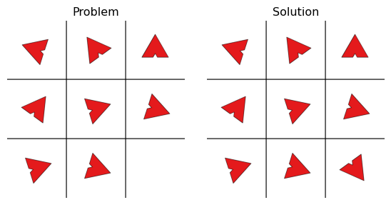

### LittleShape

`LittleShape` shares nearly all AttributeTypes with `BigShape`. However,
because it is smaller in size, multiple `LittleShape` elements can be
placed within a single grid cell. Consequently, its `NUMBER`
AttributeType behaves differently. `LittleShape` supports the following
AttributeTypes:

- **`LITTLESHAPENUMBER`**  
  Indicates the number of `LittleShape` objects placed in a grid cell.
  Four values are available: `ONE`, `TWO`, `THREE`, and `FOUR`.

- **`SHAPE`**  
  Defines the shapes of the LittleShape object. There are currently six
  shapes, ordered from least to most polygonal: `TRIANGLE`, `SQUARE`,
  `PENTAGON`, `SEPTAGON`, and `CIRCLE`.

- **`COLOR`**  
  Specifies the color of the object. Eight color options are available:
  `BLUE`, `ORANGE`, `GREEN`, `BROWN`, `PURPLE`, `GRAY`, `RED`, and
  `YELLOW`. All hues have been selected to be colorblind-friendly.

- **`SIZE`**  
  Determines the scale of the LittleShape. There are three size
  instances: `SMALL`, `MEDIUM`, and `LARGE`.

- **`ANGLE`**  
  Specifies the rotation angle of the LittleShape object. This attribute
  includes 10 discrete values, increasing in 36-degree increments. It is
  particularly well-suited for the `PROGRESSION` rule type.

#### Example

Let’s now see if we can make an arithmetic puzzle for the
`LITTLESHAPENUMBER` attribute of `LittleShape`. We’ll fix the other
attributes to keep the visual appearance consistent across the puzzle.
Specifically, we’ll set the `COLOR` to `GREEN`, the `SIZE` to `LARGE`,
and the `SHAPE` to `CIRCLE`.

``` python
import omss
from omss import Ruletype, AttributeType, Rule, create_matrix, plot_matrices

rules = {
    'LittleShape': [       
        Rule(Ruletype.FULL_CONSTANT, AttributeType.SHAPE, value = 'circle'),
        Rule(Ruletype.FULL_CONSTANT, AttributeType.ANGLE),
        Rule(Ruletype.FULL_CONSTANT, AttributeType.COLOR, value = 'green'),
        Rule(Ruletype.ARITHMETIC, AttributeType.LITTLESHAPENUMBER),
        Rule(Ruletype.FULL_CONSTANT, AttributeType.SIZE, value = 'large')]}
    

#create the matrices
solution_matrix, problem_matrix, = create_matrix(rules, save = False)

#plot the matrices
plot_matrices(solution_matrix, problem_matrix)
```

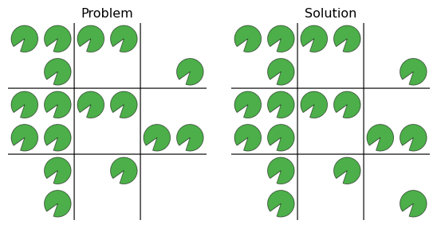

### Line

As the name suggests, `Line` places a line-shaped object in the grid. It
supports the following AttributeTypes:

- **`LINETYPE`**  
  Specifies the visual style of the line. There are three options:
  `SOLID`, `CURVED`, and `WAVED`, placing a solid, curved, or waved line
  in the grid, respectively.

- **`LINENUMBER`**  
  Indicates the number of lines placed within a grid cell. Five values
  are available: `ONE`, `TWO`, `THREE`, `FOUR`, and `FIVE`.

- **`ANGLE`**  
  Specifies the rotation angle of the Line object. This attribute
  includes 10 discrete values, increasing in 36-degree increments.

#### Examples

Let’s try to make a basic Line puzzle. For now we won’t specify any
specific attributetypes. We will just make a Line puzzle that progresses
both in Linenumber and Angle!

``` python
import omss
from omss import Ruletype, AttributeType, Rule, create_matrix, plot_matrices

rules = {
    'Line': [       
        Rule(Ruletype.CONSTANT, AttributeType.LINETYPE),
        Rule(Ruletype.PROGRESSION, AttributeType.ANGLE),
        Rule(Ruletype.PROGRESSION, AttributeType.LINENUMBER)]}
 
    

#create the matrices
solution_matrix, problem_matrix, = create_matrix(rules, save = False)

#plot the matrices
plot_matrices(solution_matrix, problem_matrix)
```

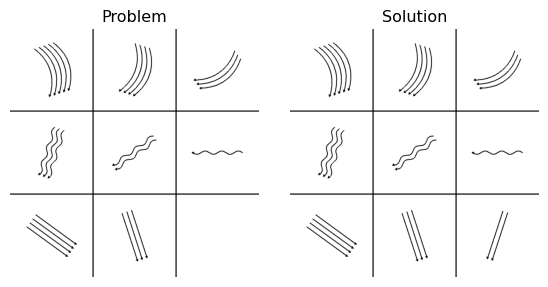

Let’s create another line puzzle! Now we will put the angles and
line-numbers to constant and apply a distribute_three to the linetypes.
As you can see, each linetype (waved, curved, straight) now appears once
in each row.

``` python
import omss
from omss import Ruletype, AttributeType, Rule, create_matrix, plot_matrices

rules = {
    'Line': [       
        Rule(Ruletype.DISTRIBUTE_THREE, AttributeType.LINETYPE),
        Rule(Ruletype.CONSTANT, AttributeType.ANGLE),
        Rule(Ruletype.CONSTANT, AttributeType.LINENUMBER)]}
 
    

#create the matrices
solution_matrix, problem_matrix, = create_matrix(rules, save = False)

#plot the matrices
plot_matrices(solution_matrix, problem_matrix)
```

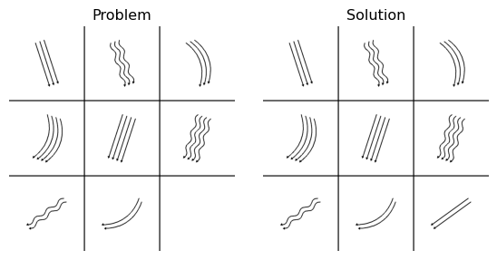

## Alternatives Generation

### Generating Alternatives

Up to this point, we have focused solely on generating puzzles. However,
for these matrix problems to function as proper reasoning tasks, a set
of (incorrect) alternatives must also be generated. The program handles
this in two broad steps:

1.  **Determining What to Modify**  
    First, the program inspects the rules that have been set for the
    puzzle. Based on these, it identifies which AttributeTypes might be
    interesting to modify when generating alternatives. Specifically, it
    avoids choosing AttributeTypes governed by `FULL_CONSTANT` and
    `CONSTANT` rules, since changes to these are typically too easy to
    spot. This process results in an ordered list of AttributeTypes that
    are eligible for modification.

2.  **Tree-Based Alternative Generation**  
    Once the list of modifiable AttributeTypes is created, the program
    uses a tree-based structure to generate the alternatives. It starts
    by copying the correct answer and applies a random modification to
    the first AttributeType in the list, producing a new variant. Both
    the original answer and this first modified version become the basis
    for the next branching step. At each subsequent level, a new
    AttributeType from the list is modified, expanding the tree.

    For example, if four alternatives (including the correct answer) are
    needed, only two levels of branching are required (yielding 4
    variants). If five alternatives are needed, an additional split is
    performed to create 8 variants, from which 5 are randomly sampled.

This approach ensures that the alternatives are structurally similar to
the correct answer, while systematically introducing variation across
relevant AttributeTypes. Moreover, because the generation process
explicitly accounts for the rules that have been applied in the puzzle,
the resulting alternatives tend to be highly plausible. In addition, the
tree-based generation process prevents the correct answer from being
inferred by simply comparing the alternatives.

#### Examples

Now let’s revisit one of our earlier examples and generate alternatives
for it. Specifically, we’ll create a `LittleShape` matrix that uses a
`DISTRIBUTETHREE` rule for `COLOR` and a `PROGRESSION` rule for
`LITTLESHAPENUMBER`. We will make four alternatives (correct answer
included), by simply setting alternatives to 4!

``` python
import omss
from omss import Ruletype, AttributeType, Rule, create_matrix, plot_matrices

rules = {
    'LittleShape': [       
        Rule(Ruletype.CONSTANT, AttributeType.SHAPE),
        Rule(Ruletype.CONSTANT, AttributeType.ANGLE),
        Rule(Ruletype.DISTRIBUTE_THREE, AttributeType.COLOR),
        Rule(Ruletype.PROGRESSION, AttributeType.LITTLESHAPENUMBER),
        Rule(Ruletype.FULL_CONSTANT, AttributeType.SIZE, value = 'medium')]}
    

#create the matrices
solution_matrix, problem_matrix, alternatives = create_matrix(rules, alternatives =4, save = False)

#plot the matrices
plot_matrices(solution_matrix, problem_matrix, alternatives)
```

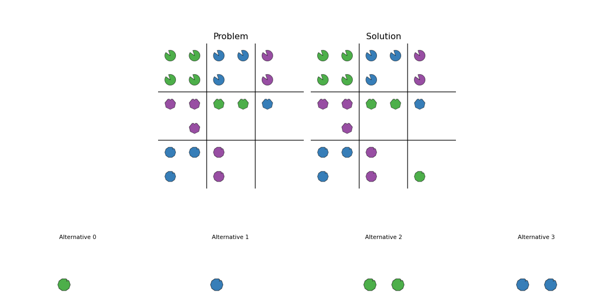

As you can see, both the `COLOR` and `LITTLESHAPENUMBER` attributes were
modified in the alternatives. This makes sense: they were the only
AttributeTypes not governed by a `CONSTANT` or `FULL_CONSTANT` rule,
making them the best candidates for variation. Now let’s change the
setup slightly. Instead of applying a `DISTRIBUTE_THREE` rule to
`COLOR`, we set it to `FULL_CONSTANT`.

``` python
import omss
from omss import Ruletype, AttributeType, Rule, create_matrix, plot_matrices

rules = {
    'LittleShape': [       
        Rule(Ruletype.CONSTANT, AttributeType.SHAPE),
        Rule(Ruletype.CONSTANT, AttributeType.ANGLE),
        Rule(Ruletype.FULL_CONSTANT, AttributeType.COLOR),
        Rule(Ruletype.PROGRESSION, AttributeType.LITTLESHAPENUMBER),
        Rule(Ruletype.FULL_CONSTANT, AttributeType.SIZE, value = 'medium')]}
    

#create the matrices
solution_matrix, problem_matrix, alternatives = create_matrix(rules, alternatives =4, save = False)

#plot the matrices
plot_matrices(solution_matrix, problem_matrix, alternatives)
```

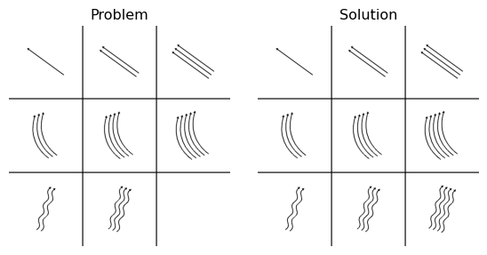

Voilà! The alternatives are now still modified in terms of
`LITTLESHAPENUMBER`, as this attribute is governed by a `PROGRESSION`
rule. However, since `COLOR` is now set to `FULL_CONSTANT`, it is less
likely to be included as modification. the program selects other
available AttributeTypes—such as `SHAPE` or `ANGLE`.

However, if you would increase the number of alternatives in the above
example (for example to 32), at some point even the FULL_CONSTANT
attributes will be modified!

Alternative generation works in the same way for matrices consisting of
multiple elements. Below we will create a matrix consisting of both a
BigShape and Line element

``` python
import omss
from omss import Ruletype, AttributeType, Rule, create_matrix, plot_matrices

rules = {'BigShape': [       
        Rule(Ruletype.DISTRIBUTE_THREE , AttributeType.SHAPE),
        Rule(Ruletype.CONSTANT, AttributeType.ANGLE),
        Rule(Ruletype.DISTRIBUTE_THREE, AttributeType.COLOR),
        Rule(Ruletype.CONSTANT, AttributeType.NUMBER),
        Rule(Ruletype.FULL_CONSTANT, AttributeType.SIZE, value = 'medium')],

    'Line': [       
        Rule(Ruletype.CONSTANT, AttributeType.LINETYPE),
        Rule(Ruletype.CONSTANT, AttributeType.ANGLE),
        Rule(Ruletype.CONSTANT, AttributeType.LINENUMBER)]}
 
    

#create the matrices
solution_matrix, problem_matrix, alternatives = create_matrix(rules, alternatives =4, save = False)

#plot the matrices
plot_matrices(solution_matrix, problem_matrix, alternatives)
```

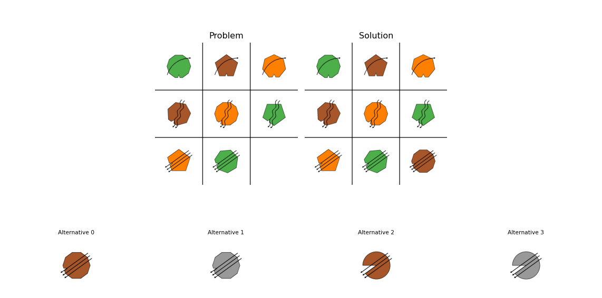

In this case, the `Line` element remains unchanged in the alternatives.
This is because all variation within the matrix comes from the `SHAPE`
and `COLOR` attributes of the `BigShape` element, while all the
atributes of the `Line` element is governed by a `CONSTANT` rule. Since
the line does not contribute to the underlying logic of the puzzle, the
program correctly avoids modifying it when generating alternatives.

However, if we now remove the `DISTRIBUTE_THREE` rule from the `COLOR`
attribute of `BigShape` and instead apply `DISTRIBUTE_THREE` to the
`LINETYPE` attribute of the `Line` element, the behavior changes. In
this configuration, variation across the matrix is now partially driven
by the `Line` element. As a result, when generating alternatives, the
program may introduce modifications to `LINETYPE` as well.

This demonstrates how shifting rule assignments across elements directly
influences which attributes are prioritized when constructing
alternative options.

``` python
import omss
from omss import Ruletype, AttributeType, Rule, create_matrix, plot_matrices

rules = {'BigShape': [       
        Rule(Ruletype.DISTRIBUTE_THREE , AttributeType.SHAPE),
        Rule(Ruletype.CONSTANT, AttributeType.ANGLE),
        Rule(Ruletype.CONSTANT, AttributeType.COLOR),
        Rule(Ruletype.CONSTANT, AttributeType.NUMBER),
        Rule(Ruletype.FULL_CONSTANT, AttributeType.SIZE, value = 'medium')],

    'Line': [       
        Rule(Ruletype.DISTRIBUTE_THREE, AttributeType.LINETYPE),
        Rule(Ruletype.CONSTANT, AttributeType.ANGLE),
        Rule(Ruletype.CONSTANT, AttributeType.LINENUMBER)]}
 
    

#create the matrices
solution_matrix, problem_matrix, alternatives = create_matrix(rules, alternatives =4, save = False)

#plot the matrices
plot_matrices(solution_matrix, problem_matrix, alternatives)
```

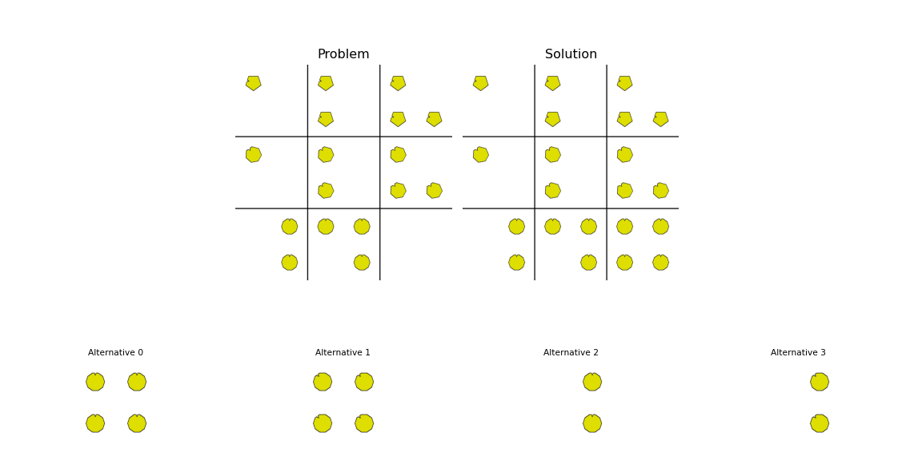

## Seeds

As you might have noticed in most of the examples above, the matrices
change each time you re-run the code. This is because both the matrix
and the alternatives are generated randomly. The only constraint is that
they must follow the specified rules and, in the case of alternatives,
modify attributes from the preselected list.

To make the generation process reproducible, the system supports the use
of **seeds**. Each matrix can be generated using a specific **matrix
seed**, which ensures that the same matrix will be created every time
for a given combination of elements, rules, and seed value.

Similarly, the generation of alternatives is controlled by a separate
**alternative seed**. By default, even with a fixed matrix seed, the
alternatives will still vary across runs. However, if the same
alternative seed is used, the exact same set of alternatives will be
produced.

This separation between matrix and alternative seeds allows for flexible
control: you can fix the matrix while still generating new alternatives,
or lock both for full reproducibility.

These seeds can also be outputted, even for matrices created without
explicitly setting a seed, by using the `output_file=True` argument.
When this option is enabled, the system saves both the matrix seed and
the alternative seed along with the generated matrix and alternatives.

#### Examples,

Let’s recreate one of our earlier examples, this time specifying a seed
to ensure reproducibility. We do this by simply setting the `seed`
parameter to `42`. This will lock the random generation process, meaning
the matrix will always look the same when this seed is used.

``` python
import omss
from omss import Ruletype, AttributeType, Rule, create_matrix, plot_matrices

rules = {
    'BigShape': [       
        Rule(Ruletype.CONSTANT, AttributeType.SHAPE),
        Rule(Ruletype.CONSTANT, AttributeType.ANGLE),
        Rule(Ruletype.DISTRIBUTE_THREE, AttributeType.COLOR),
        Rule(Ruletype.CONSTANT, AttributeType.NUMBER),
        Rule(Ruletype.FULL_CONSTANT, AttributeType.SIZE, value = 'medium')]}
    

#create the matrices
solution_matrix, problem_matrix, alternatives = create_matrix(rules, alternatives =4, seed=42, save = False)

#plot the matrices
plot_matrices(solution_matrix, problem_matrix, alternatives)
```

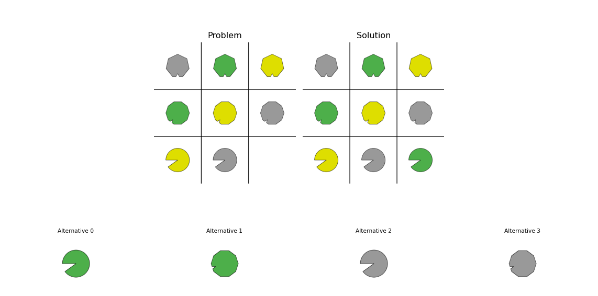

As expected, the matrix now looks exactly the same each time you run it!
However, the alternatives might still differ between runs, since their
generation relies on a separate random process.

To ensure the alternatives remain consistent as well, we can set a
second seed: `alternative_seed`. By setting `alternative_seed=42`, we
lock the generation of the alternatives, making both the matrix and its
answer options fully reproducible.

``` python
import omss
from omss import Ruletype, AttributeType, Rule, create_matrix, plot_matrices

rules = {
    'BigShape': [       
        Rule(Ruletype.CONSTANT, AttributeType.SHAPE),
        Rule(Ruletype.CONSTANT, AttributeType.ANGLE),
        Rule(Ruletype.DISTRIBUTE_THREE, AttributeType.COLOR),
        Rule(Ruletype.CONSTANT, AttributeType.NUMBER),
        Rule(Ruletype.FULL_CONSTANT, AttributeType.SIZE, value = 'medium')]}
    

#create the matrices
solution_matrix, problem_matrix, alternatives = create_matrix(rules, alternatives =4, seed=42, alternative_seed =42, save = False)

#plot the matrices
plot_matrices(solution_matrix, problem_matrix, alternatives)
```

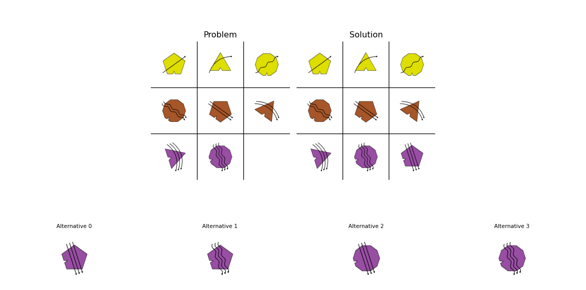

It is also possible to set a seed for the alternatives without setting a
seed for the matrix. In this case, the alternatives become constrained.

1.  Based on the same input matrix, the alternatives will always be the
    same—because the `alternative_seed` ensures deterministic behavior.
2.  However, since the matrix itself is randomly generated (due to the
    absence of a `seed`), the input to the alternatives will vary
    between runs.

In essence, this means that for a given combination of rules and
attribute types, the same internal logic will be used to generate the
list of attributes that are modified in the alternatives. While the
content of the matrix changes between runs, the way in which
alternatives are built from it remains fixed. This allows for some
consistency in how variation is introduced in the alternatives while
still producing fresh matrices each time.
